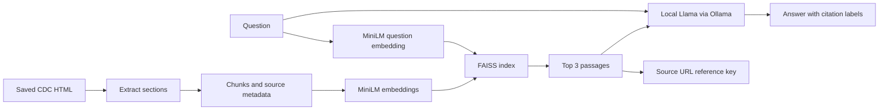

# Healthcare RAG Assistant

A local educational document assistant using Python, Sentence Transformers, FAISS, and Llama 3.1 through Ollama. It retrieves evidence from three CDC diabetes articles, generates answers, and displays source references.

This is an ongoing learning and portfolio project, not a clinically validated system or a tool for personal diagnosis or treatment.

## Current features

- Keyword baseline over six fictional clinic passages.
- MiniLM embeddings: 384-dimensional normalized vectors.
- FAISS `IndexFlatIP` for exact cosine-similarity search.
- CDC article extraction with source URLs, review dates, and fingerprints.
- Paragraph/sentence chunking: 180 content-token budget, zero overlap, validated against the 256-token model limit.
- Local `llama3.1:8b` generation with requested citations and missing-evidence handling.
- Retrieval evaluation and saved answers for manual review.

The included CDC snapshot contains **3 documents and 20 chunks**. LangChain is not used; this project connects the underlying components directly.

## Architecture



## Setup

Developed on Apple Silicon with 24 GB RAM and Python 3.14; other platforms have not been verified. Install [Ollama](https://ollama.com/download) separately and keep its service running.

```bash
git clone https://github.com/santhosh-madha/healthcare-rag-assistant.git
cd healthcare-rag-assistant
python3 -m venv .venv
source .venv/bin/activate
python -m pip install -r requirements.txt
ollama pull llama3.1:8b
python healthcare_assistant.py "What is insulin resistance?"
```

The first embedding run downloads MiniLM into `.cache/models`. Ollama stores its model separately. Inference is local; initial downloads require internet access. `requirements-lock.txt` records the development environment; `requirements.txt` lists direct dependencies.

The processed CDC snapshot is included, so article downloading and extraction are optional for trying the assistant.

## Learning stages

```bash
python retrieve.py "How to call off my booking?"
python semantic_search.py "How to call off my booking?"
python evaluate_retrieval.py
python rag_assistant.py "How can I request a copy of my records?"
python evaluate_answers.py
python search_healthcare.py "Can type 2 diabetes have no noticeable symptoms?"
python healthcare_assistant.py "What is insulin resistance?"
```

Fictional-clinic tests and CDC searches use separate collections. Generation reports go into `evaluation_runs/`, excluded from Git by default. Debug output exposes vectors, retrieval results, and evidence for learning.

## Evaluation so far

On **five answerable fictional-clinic development questions**:

| Method | Hit@1 | Hit@3 |
|---|---:|---:|
| Keyword | 3/5 (60%) | 3/5 (60%) |
| Semantic | 4/5 (80%) | 5/5 (100%) |

Hit@1 checks whether expected evidence ranks first; Hit@3 checks whether it appears in the first three. An additional missing-information question is inspected separately. These are not held-out benchmark results or medical accuracy measurements.

An eight-question generation run produced four supported answers to five answerable questions, appropriate refusals for two missing-information questions, and an overly terse refusal for a partial-evidence question. The typo case failed despite relevant evidence being retrieved. Review was AI-assisted, not independently human-verified.

Three CDC generation smoke checks completed: two produced supported main answers, and one declined an unavailable clinic-phone-number question. One answer added an uncited statement; the refusal did not match the requested wording exactly. Broader CDC evaluation is pending.

## Sources and rebuilding

- [CDC: Diabetes Basics](https://www.cdc.gov/diabetes/about/index.html)
- [CDC: Type 2 Diabetes](https://www.cdc.gov/diabetes/about/about-type-2-diabetes.html)
- [CDC: Symptoms of Diabetes](https://www.cdc.gov/diabetes/signs-symptoms/index.html)

Source text is attributed to its original publisher. This project is not affiliated with or endorsed by CDC. The included snapshot may differ from current pages; source review dates are not download dates.

The automated downloader encountered HTTP 403 responses, so browser-saved HTML was used. To reproduce extraction, save the articles under `data/raw/manual_cdc/` with these filenames:

```text
Diabetes Basics _ Diabetes _ CDC.html
Type 2 Diabetes _ Diabetes _ CDC.html
Symptoms of Diabetes _ Diabetes _ CDC.html
```

Then run:

```bash
python extract_documents.py
python chunk_documents.py
```

Rebuilding replaces processed outputs and can change chunk IDs and search results. Raw browser downloads, environments, model caches, and local evaluation reports are excluded from Git.

## Limitations and next stages

- Citation labels are generated by the model; support and coverage are not automatically verified.
- Similarity is not confidence; nearest-neighbor search can return irrelevant evidence.
- Sentence splitting is heuristic; headings may become separated from their paragraphs.
- The FAISS index is rebuilt in memory each run.
- Prompt changes have caused regressions, including incorrect refusals.
- Next: broader CDC evaluation, citation checks, persistent indexing, and an interface.

Earlier exercises are preserved in [learning notes](docs/learning-notes.md); these describe the initial stages, not current feature completeness.
