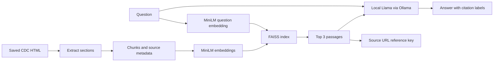

# Healthcare RAG Assistant

A local educational document assistant using Python, Sentence Transformers, FAISS, and Llama 3.1 through Ollama. It retrieves evidence from three CDC diabetes articles, generates answers, and displays source references.

This is an ongoing learning and portfolio project, not a clinically validated system or a tool for personal diagnosis or treatment.

## Current features

- Keyword baseline over six fictional clinic passages.
- MiniLM embeddings: 384-dimensional normalized vectors.
- FAISS `IndexFlatIP` for exact cosine-similarity search.
- CDC article extraction with source URLs, review dates, and fingerprints.
- Paragraph/sentence chunking: 180 content-token budget, zero overlap, validated against the 256-token model limit.
- Local `llama3.1:8b` generation with requested citations and missing-evidence handling.
- Structured JSON answers with source-ID and evidence-quote validation.
- Persistent FAISS index with corpus/model consistency checks.
- Interactive terminal sessions with optional verbose diagnostics.
- Retrieval evaluation and saved answers for manual review.

The included CDC snapshot contains **3 documents and 20 chunks**. LangChain is not used; this project connects the underlying components directly.

## Architecture



## Setup

Developed on Apple Silicon with 24 GB RAM and Python 3.14; other platforms have not been verified. Install [Ollama](https://ollama.com/download) separately and keep its service running.

```bash
git clone https://github.com/santhosh-madha/healthcare-rag-assistant.git
cd healthcare-rag-assistant
python3 -m venv .venv
source .venv/bin/activate
python -m pip install -r requirements.txt
ollama pull llama3.1:8b
python persistent_search.py --build
python structured_healthcare.py "What is insulin resistance?"
```

Run the CDC development evaluation (requires Ollama for generation):

```bash
python evaluate_healthcare.py --retrieval-only
python evaluate_healthcare.py
python evaluate_healthcare.py --structured
python evaluate_healthcare.py --structured --questions cdc_holdout_questions.json
```

The eight-question CDC set covers six answerable and two missing-information cases. Strict annotated retrieval hits were 5/6 at rank one and 6/6 within three. The age question's first result is also relevant but is not included in its evidence annotations, so the strict rank-one miss is not a proven retrieval failure. This is a development set, not a held-out benchmark.

Review of the earlier free-form baseline found contradictory refusals on the typo and age cases, incomplete citation coverage, and an unsupported extrapolation in the testing answer. Both missing-information cases declined appropriately. Reports are saved locally; citation-label checks validate IDs only, not factual support. No aggregate answer-accuracy claim is made.

The first embedding run downloads MiniLM into `.cache/models`. Ollama stores its model separately. Inference is local; initial downloads require internet access. `requirements-lock.txt` records the development environment; `requirements.txt` lists direct dependencies.

The processed CDC snapshot is included, so article downloading and extraction are optional for trying the assistant.

## Learning stages

```bash
python retrieve.py "How to call off my booking?"
python semantic_search.py "How to call off my booking?"
python evaluate_retrieval.py
python rag_assistant.py "How can I request a copy of my records?"
python evaluate_answers.py
python search_healthcare.py "Can type 2 diabetes have no noticeable symptoms?"
python healthcare_assistant.py "What is insulin resistance?"
```

Fictional-clinic tests and CDC searches use separate collections. Generation reports go into `evaluation_runs/`, excluded from Git by default. Debug output exposes vectors, retrieval results, and evidence for learning.

## Evaluation so far

On **five answerable fictional-clinic development questions**:

| Method | Hit@1 | Hit@3 |
|---|---:|---:|
| Keyword | 3/5 (60%) | 3/5 (60%) |
| Semantic | 4/5 (80%) | 5/5 (100%) |

Hit@1 checks whether expected evidence ranks first; Hit@3 checks whether it appears in the first three. An additional missing-information question is inspected separately. These are not held-out benchmark results or medical accuracy measurements.

An eight-question generation run produced four supported answers to five answerable questions, appropriate refusals for two missing-information questions, and an overly terse refusal for a partial-evidence question. The typo case failed despite relevant evidence being retrieved. Review was AI-assisted, not independently human-verified.

Three CDC generation smoke checks completed: two produced supported main answers, and one declined an unavailable clinic-phone-number question. One answer added an uncited statement; the refusal did not match the requested wording exactly. Subsequent structured runs are summarized below.

## Sources and rebuilding

- [CDC: Diabetes Basics](https://www.cdc.gov/diabetes/about/index.html)
- [CDC: Type 2 Diabetes](https://www.cdc.gov/diabetes/about/about-type-2-diabetes.html)
- [CDC: Symptoms of Diabetes](https://www.cdc.gov/diabetes/signs-symptoms/index.html)

Source text is attributed to its original publisher. This project is not affiliated with or endorsed by CDC. The included snapshot may differ from current pages; source review dates are not download dates.

The automated downloader encountered HTTP 403 responses, so browser-saved HTML was used. To reproduce extraction, save the articles under `data/raw/manual_cdc/` with these filenames:

```text
Diabetes Basics _ Diabetes _ CDC.html
Type 2 Diabetes _ Diabetes _ CDC.html
Symptoms of Diabetes _ Diabetes _ CDC.html
```

Then run:

```bash
python extract_documents.py
python chunk_documents.py
```

Rebuilding replaces processed outputs and can change chunk IDs and search results. Raw browser downloads, environments, model caches, and local evaluation reports are excluded from Git.

## Limitations and next stages

- Citation labels are generated by the model; support and coverage are not automatically verified.
- Similarity is not confidence; nearest-neighbor search can return irrelevant evidence.
- Sentence splitting is heuristic; headings may become separated from their paragraphs.
- Earlier assistants and evaluation rebuild the index each run; the structured assistant now loads a saved index (see below).
- Prompt changes have caused regressions, including incorrect refusals.
- Next: an interface, broader evaluation, and stronger assessment of whether evidence supports each claim.

Earlier exercises are preserved in [learning notes](docs/learning-notes.md); these describe the initial stages, not current feature completeness.

## Saved-index structured assistant

Build document embeddings once, then query with checked evidence quotes:

```bash
python persistent_search.py --build
python structured_healthcare.py "What is insulin resistance?"
python -m unittest discover -v
```

The structured assistant loads the saved local index and embeds only the question. Rebuild after changing chunks or embedding models. Generated index files are ignored by Git. Model startup still occurs for every command. The evaluation runner and earlier assistants retain their in-memory indexing paths. Validation checks JSON structure, source IDs, and quoted text after whitespace normalization (including spaces before commas and periods). It does not verify semantic entailment or whether a refusal is justified. Model-weight revisions are not pinned.

## Interactive terminal session

```bash
python structured_healthcare.py
# Optional debug details:
python structured_healthcare.py --verbose
```

The model and saved index load once per session. Ask independent questions and type `/exit` to quit. There is no conversation memory. The session uses its initial document snapshot until restarted. Default output shows answers, evidence quotes, and source URLs; verbose mode additionally prints retrieval internals and raw JSON. Library startup messages may still appear. A quoted question still runs once and exits.

## Structured evaluation checkpoint

The eight-question development run passed structure/source/quote validation on all eight responses; annotated retrieval Hit@1 was 5/6 and Hit@3 was 6/6 for answerable questions. A first six-question held-out run had four answerable questions with Hit@1 and Hit@3 of 4/4, plus two missing-information cases; all six responses passed validation. These small runs preceded the punctuation-spacing fix and do not establish general answer accuracy.

AI-assisted review found the main answers supported and missing-information questions appropriately declined, with a minor precision issue in an additional claim about insulin release. Review was not independently human-verified. These sets are now inspected regression sets, not fresh holdouts for future tuning.

All 28 local unit/integration tests pass, covering quote validation, persistent-index consistency, and interactive session behavior. A user-run regression confirmed that quotes differing only in spaces before punctuation now pass. Matching a quote still does not prove it supports the generated claim.

## Local browser interface

Keep Ollama running, then start the app from your activated environment:

```bash
python web_assistant.py
```

Open http://127.0.0.1:8000 in your browser. Build the saved index first with `python persistent_search.py --build` if it is missing or stale. No additional packages are required. Stop the server with Ctrl-C; use `--port 8001` if port 8000 is busy.

The page provides example questions, validated answers, evidence quotes, source links, and expandable retrieved passages. Failed validation withholds the answer; generation failures show a retry message. Previous answers clear when a new request starts. Each question is independent. The embedding model and index load once at startup; restart after rebuilding the index.

`web_assistant.py` handles local HTTP requests and calls the existing retrieval, Ollama, and validation functions. `web/index.html` contains the browser layout and request/rendering code. Model content is rendered as plain text. The server binds only to loopback and processes one request at a time; it is a local learning demo, not a public deployment server. It does not save question history. Retrieval debug text is printed in the server terminal.

## Human answer review

Create a local evidence sheet and editable score file from a saved generation report:

```bash
python review_answers.py evaluation_runs/YOUR_REPORT.json
python review_answers.py evaluation_runs/reviews/YOUR_REPORT_review.json --summary
```

Read the generated Markdown sheet alongside its JSON score file. Set `reviewer` to your name, then score correctness, evidence support, completeness, and refusal behavior using `pass`, `fail`, or `na`. Record failure categories and reasoning in `notes`; mark `completed` true only when finished. The sheet includes a rubric and the saved evidence; it does not call a model or assign scores. Summaries exclude unfinished reviews and report `na` separately. Original evaluation reports are preserved and generated review files stay in the ignored `evaluation_runs/reviews/` folder. Repeating creation refuses to overwrite your work. Review the document snapshot, not external medical assumptions; these judgments are not clinical validation.

## Twenty-question challenge set

`cdc_challenge_questions.json` contains five direct questions, five paraphrase/typo questions, five questions requiring multiple facts, and five missing-information/false-premise questions. Expected behavior and evidence were written before generation. Seventeen are answerable (including two false premises that the text can correct); three require abstention. The questions use the same familiar three-document snapshot and are not a new-document benchmark.

```bash
python evaluate_healthcare.py --structured --questions cdc_challenge_questions.json
```

Hit@k counts a match to any annotated evidence. For multiple-fact questions, inspect whether all required facts were retrieved and covered in the answer; one retrieval hit does not establish completeness. Preserve the first completed run before using this set to improve prompts or retrieval. Create review sheets from its saved report with `review_answers.py`.

The first completed challenge run retrieved annotated evidence at rank one for 10/17 answerable questions and within three for 15/17. Generation completed for all 20; 17 passed mechanical validation and three failed it. Initial AI-assisted inspection found an unsupported claim despite matching quotes, incomplete answers following retrieval misses, and refusals on two correctable false premises. These are development findings, not an answer-accuracy score. A preceding sandbox connection failure was excluded from model-quality interpretation. The challenge set has now been inspected and should be treated as a regression set for further changes.

## Experimental hybrid retrieval

The default assistants still use dense MiniLM/FAISS search. `hybrid_search.py` experiments with combining it with BM25 exact-term search using reciprocal rank fusion (RRF). BM25 rewards distinctive matching words while adjusting for passage length and repeated terms; RRF combines the two ranked lists without treating their raw scores as comparable. Fixed settings: BM25 k1=1.5, b=0.75; top 10 candidates per method; RRF k=60; final top 3. No new dependencies or embeddings are needed. The lexical index is computed in memory per query for this small corpus.

```bash
python compare_retrieval.py cdc_challenge_questions.json cdc_evaluation_questions.json cdc_holdout_questions.json
python evaluate_healthcare.py --structured --retriever hybrid --questions cdc_challenge_questions.json
```

The first comparison on inspected regression sets:

| Set | Dense Hit@1 | Hybrid Hit@1 | Dense Hit@3 | Hybrid Hit@3 |
|---|---:|---:|---:|---:|
| Challenge | 10/17 | 15/17 | 15/17 | 17/17 |
| Earlier development | 5/6 | 4/6 | 6/6 | 6/6 |
| Previously held-out | 4/4 | 4/4 | 4/4 | 4/4 |

Both original challenge misses moved to rank one, but one challenge comparison and one older paraphrase lost rank-one annotation hits. Matching every listed evidence excerpt within the top three improved from 14/17 to 16/17 on the challenge set. That stricter metric is still literal annotation coverage, not semantic completeness; on older sets, annotations may be alternative ways to support the same fact. A type 1/type 2 mechanism comparison still lacked complete annotated coverage.

Hybrid results retain cosine scores separately from `fusion_score` and record dense/BM25 ranks. A lexical-only candidate has no cosine score (`null`); do not display its fusion score as cosine similarity or confidence. This experiment has not replaced the browser/CLI defaults. The comparison reports are local and ignored by Git.

A targeted generation rerun of the two original retrieval misses, with unchanged prompt and corpus, produced two validated answers whose quotes supported the requested information on AI-assisted inspection. This is a two-case regression check, not a full hybrid answer evaluation or independent human review. Full generation regression is still required before promoting hybrid search to the default.

## Opt-in generation experiment

`experimental_prompt.py` adds instructions for one-source claims, correcting false premises, avoiding unsupported negative statements, and preserving qualifications. It is available only through an explicit evaluation option; the browser and terminal assistants retain the original prompt.

```bash
python evaluate_healthcare.py --structured --retriever hybrid --prompt-variant atomic --questions cdc_challenge_questions.json
```

Reports retain the complete prompt and variant name. Compare this with the original hybrid run using the same question set and retrieved contexts. More instructions do not guarantee better answers: requiring atomic claims can conflict with the two-claim limit on list questions. Keep unsuccessful experiments as regression evidence rather than silently adopting them.

The first atomic-prompt run used the same 20 retrieved contexts as the original hybrid run. Validation passes fell from 19/20 to 17/20. AI-assisted inspection found one repaired count failure but new quote/count failures, lost source uncertainty, and a related-but-unresponsive answer to an unavailable email request. False-premise refusals persisted. The experiment is retained for reproducibility and is **not promoted to the default**. One run per prompt does not measure generation variability.

## JSON-schema generation experiment

Ollama accepts a JSON Schema object in its `format` field ([official documentation](https://docs.ollama.com/capabilities/structured-outputs)). This opt-in experiment uses the original prompt and hybrid retrieval:

```bash
python evaluate_healthcare.py --structured --retriever hybrid --schema --questions cdc_challenge_questions.json
```

`structured_schema.py` defines two response branches: answered with one or two claims, or insufficient evidence with no claims. Claim source labels are restricted to the retrieved IDs; required fields, strings, and allowed properties are specified. The exact schema sent is saved for each response in the report. The ordinary validator still checks the result, including quote matching. Constraints cannot establish factual support, appropriate refusals, or preservation of source qualifications. No automatic retry, prompt change, or increased output budget is part of this experiment. Browser and CLI defaults remain unchanged.

The first schema run passed all 20 mechanical validations (original hybrid: 19/20) with unchanged prompt and retrieved contexts. AI-assisted inspection still found incomplete quote support, extra claims unrelated to the question, duplicate claims, and false-premise refusals. This demonstrates improved structural compliance in one run, **not 100% answer accuracy**. Historical runtime/model digests were not captured, so strict runtime equivalence cannot be established. The schema option remains experimental.
