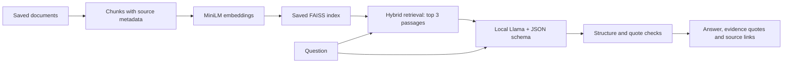

# Healthcare RAG Assistant

A local educational RAG application that answers questions from a saved CDC diabetes collection and displays evidence quotes and source links. Built with Python, Sentence Transformers, FAISS, and Llama 3.1 through Ollama.

The included collection contains **3 documents and 20 chunks**. This project demonstrates document ingestion, retrieval, structured generation, and citation checks. It is not a clinically validated system or a tool for personal diagnosis or treatment.

## Run locally

Developed on Apple Silicon with Python 3.14 and 24 GB RAM. Install [Ollama](https://ollama.com/download) separately and keep it running.

```bash
git clone https://github.com/santhosh-madha/healthcare-rag-assistant.git
cd healthcare-rag-assistant
python3 -m venv .venv
source .venv/bin/activate
python -m pip install -r requirements.txt
ollama pull llama3.1:8b
python persistent_search.py --build
python web_assistant.py
```

Open [the local app](http://127.0.0.1:8000). Stop it with Ctrl-C; use `--port 8001` if port 8000 is occupied. The first embedding run downloads MiniLM; subsequent runs reuse the cache. The processed documents are included, so downloading source pages is optional.

For terminal use:

```bash
python structured_healthcare.py "What is insulin resistance?"
python structured_healthcare.py                 # independent questions in one session
python structured_healthcare.py --verbose       # show retrieval and raw responses
```

## How it works


```mermaid
flowchart LR
    D[Saved documents] --> C[Chunks with source metadata]
    C --> E[MiniLM embeddings]
    E --> I[Saved FAISS index]
    Q[Question] --> R[Hybrid retrieval: top 3 passages]
    I --> R
    R --> L[Local Llama + JSON schema]
    Q --> L
    L --> V[Structure and quote checks]
    V --> U[Answer, evidence quotes and source links]
```

The web and terminal apps use hybrid retrieval (semantic + BM25), the original structured prompt, JSON-schema-constrained generation, and the existing quote validator. The evaluation command retains explicit options for comparing earlier baselines.

- Embeddings: normalized 384-dimensional MiniLM vectors.
- Search: FAISS `IndexFlatIP` + BM25, combined with reciprocal-rank fusion.
- Persistence: corpus/model checks and index checksum; document vectors are reused.
- Generation: local `llama3.1:8b`; each question is independent.
- Validation: response structure, source labels, and quoted text with limited whitespace normalization.

**A matching quote does not prove that it supports the entire claim.** Similarity scores are not confidence scores. Saved pages can become outdated. The local web server is a single-user demo, not a public production deployment.

## Repository layout

```text
healthcare_rag/             Application and shared retrieval/generation code
  ingestion/               Download, extract and chunk documents
  evaluation/              Evaluate answers and prepare local review sheets
  experiments/             Optional retrieval, prompt and support-judge experiments
  examples/                Earlier learning exercises
  paths.py                 Shared repository paths
web/                       Browser interface
tests/                    Automated tests
data/
  processed/               Included CDC document and chunk snapshots
  evaluation/              Question sets and support examples
  sample/                  Fictional clinic documents for early exercises
docs/                     Architecture, command guide and experiment history
web_assistant.py           Browser launcher
structured_healthcare.py   Terminal launcher
persistent_search.py       Saved-index launcher
```

The three root Python files are thin launchers. Other commands run as modules from the repository root; see the [command guide](docs/commands.md).

## Evaluation

```bash
python -m unittest discover -v
python -m healthcare_rag.evaluation.evaluate_healthcare --retrieval-only
python -m healthcare_rag.evaluation.evaluate_healthcare --structured --retriever hybrid --schema --questions data/evaluation/cdc_challenge_questions.json
```

Observed challenge-set retrieval results on **17 answerable questions**:

| Method | Hit@1 | Hit@3 |
|---|---:|---:|
| Semantic | 10/17 | 15/17 |
| Hybrid | 15/17 | 17/17 |

These are inspected development-set results, not a general accuracy benchmark. Hybrid retrieval also caused some rank-one regressions on older questions. A schema-constrained run passed all 20 mechanical checks but still contained evidence-support problems. See [experiment history](docs/development-history.md) for methods, limitations, and unsuccessful experiments.

## Documents and attribution

The saved source collection is [Diabetes Basics](https://www.cdc.gov/diabetes/about/index.html), [Type 2 Diabetes](https://www.cdc.gov/diabetes/about/about-type-2-diabetes.html), and [Symptoms of Diabetes](https://www.cdc.gov/diabetes/signs-symptoms/index.html). Source titles, URLs, sections, dates, and fingerprints are retained. This project is not affiliated with or endorsed by CDC. A source review date is not a download date.

`requirements.txt` lists direct dependencies; `requirements-lock.txt` records the development environment. Environments, credentials, model caches, raw downloads, generated indexes, evaluation reports, and private progress notes are excluded from Git. Rebuild the saved index after changing chunks or embedding settings.

## Larger data exercise

A separate MedQuAD importer and hybrid search command expand the exercise to **500 answer records, 481 source documents, and 1,020 chunks** with source URLs and fingerprints. Questions are kept separately for retrieval checks. The web app offers CDC and MedQuAD when their saved indexes are available. See [data setup, attribution, and measured results](docs/medquad.md).

### Select a collection

Start `python web_assistant.py` and choose CDC or MedQuAD in the document collection menu. Restart an already-running server to load this update. MedQuAD appears only when its prepared corpus and matching saved index load successfully; CDC remains available if MedQuAD is missing.

```bash
python structured_healthcare.py --collection medquad "What are the symptoms of Adult Acute Myeloid Leukemia?"
python structured_healthcare.py --collection cdc "What is insulin resistance?"
```

Both collections use hybrid retrieval, schema-constrained generation, and quote matching. These mechanical checks do not establish factual support.
