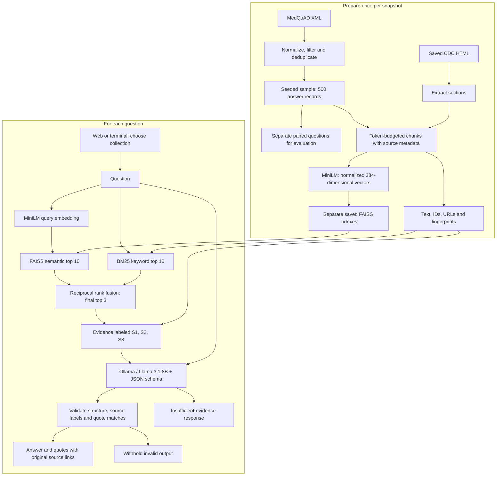

# Architecture

Two stages connect source documents to cited answers. Each collection keeps its own corpus and FAISS index; the embedding model is shared.

## Code map

| Responsibility | Implementation |
|---|---|
| Import and chunk MedQuAD | `healthcare_rag/ingestion/import_medquad.py`, `chunk_medquad.py` |
| Encode and persist vectors | `semantic_search.py`, `persistent_search.py` |
| Choose corpus/index | `collections.py` |
| Combine semantic and keyword retrieval | `hybrid_search.py` |
| Generate and validate answers | `structured_healthcare.py`, `structured_schema.py`, `rag_assistant.py` |
| Serve the interface | `web_assistant.py`, `web/index.html` |
| End-to-end smoke checks | `evaluation/medquad_smoke.py` |

Paths in the table are relative to `healthcare_rag/` unless shown otherwise. The interface file is at repository-root `web/index.html`.

FAISS stores vectors; accompanying metadata maps vector positions back to passages. Source labels are assigned per question. The system does not fine-tune Llama, retain conversation memory, or verify clinical correctness. A real quote can still be insufficient to support a claim; validation failures are withheld rather than displayed as answers.
