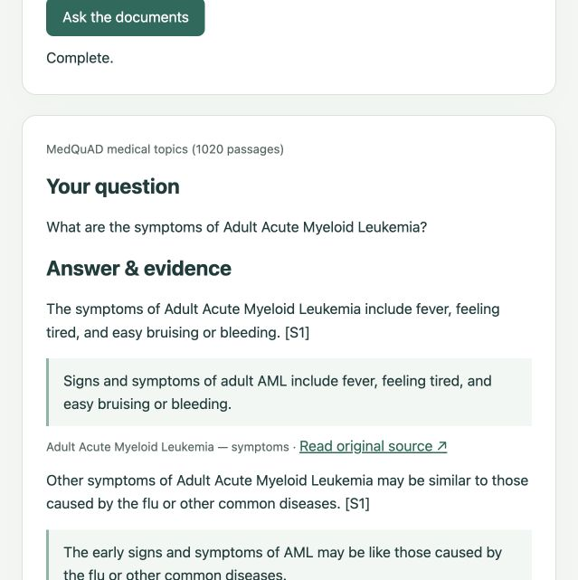
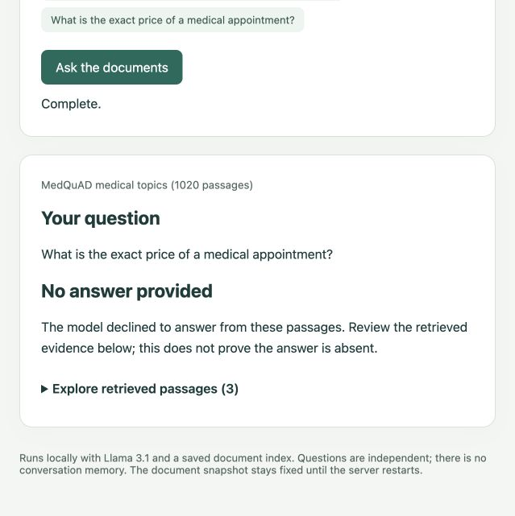

# Three-minute demo

## Before presenting

Follow the [README setup](../README.md#run-locally) and [MedQuAD preparation](medquad.md#reproduce). Keep Ollama running with `llama3.1:8b`, then start:

```bash
python web_assistant.py
```

Open http://127.0.0.1:8000 (or the port printed by the server). Warm up with one question before recording; first-load time differs from query latency. MedQuAD is optional and appears only when its prepared data and matching index are available. No account or API key is needed for local generation.

## Walkthrough

1. **Explain the purpose — 20 seconds.** “This educational assistant answers from saved healthcare documents and exposes the evidence behind its response. I built ingestion, hybrid retrieval, local generation, and quote validation.”
2. **Show a cited answer — 45 seconds.** Select MedQuAD and ask “What are the symptoms of Adult Acute Myeloid Leukemia?” Point out the answer, S1 label, copied quote, and original-source link. S1 identifies a retrieved passage for this question, not a permanent document ID.
3. **Inspect retrieval — 30 seconds.** Expand “Explore retrieved passages.” Explain that semantic similarity and BM25 keyword matches are combined with reciprocal rank fusion. Scores are ranking signals, not confidence. Some retrieved passages can concern a different condition; they should not support the answer.
4. **Show missing information — 25 seconds.** Ask “What is the exact price of a medical appointment?” Show the no-answer response and available retrieved evidence. A refusal is model behavior, not proof that the answer is absent from the whole corpus.
5. **Switch collections — 20 seconds.** Choose CDC and ask “What is insulin resistance?” Explain that collection selection routes to a separate saved index while reusing the same answer pipeline.
6. **Explain the architecture and results — 40 seconds.** Open [the diagram](architecture.md). Explain preparation versus question-time retrieval. Mention 500 MedQuAD records, 1,020 chunks, and the [ten-case smoke check](medquad-smoke-check.md). Quote matching checks text occurrence; it does not prove every claim is supported.

Responses can vary. If evidence validation fails, explain that the answer is withheld; do not present a failed run as a successful validation.

## Screenshots from the running app

Captured locally on 2026-09-27, using actual model responses and the saved MedQuAD snapshot. These are interface examples, not independent verification of medical content.

### Answer and cited evidence



### Missing information



## Reproduce the smoke check

```bash
python -m healthcare_rag.evaluation.medquad_smoke
```

This runs ten development questions and saves responses, retrieved sources, validation outcomes, and timings locally. The recorded run produced eight answers and two refusals with ten mechanical validation passes. The small sample does not establish general answer accuracy. See the report for context-dependent citations found during inspection.
